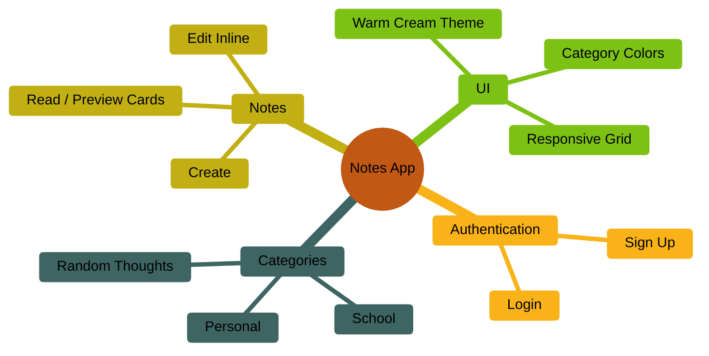
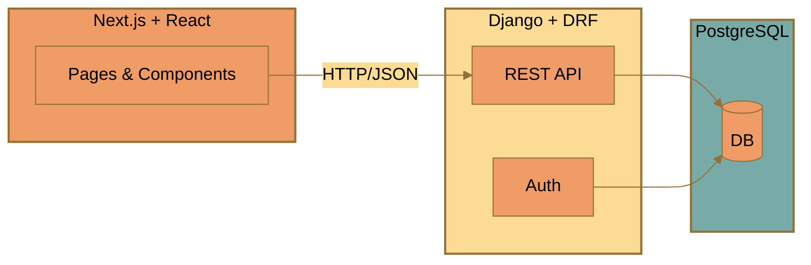
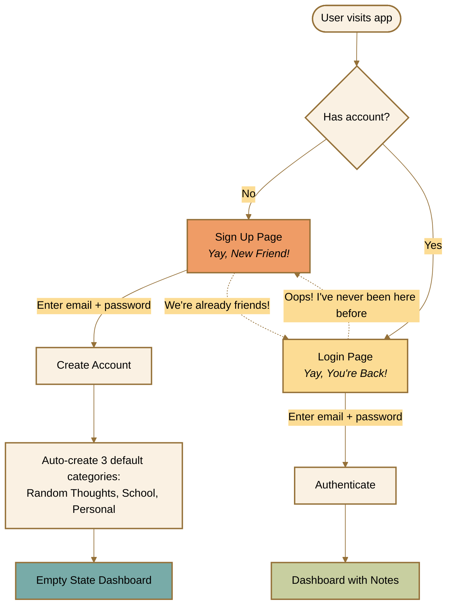
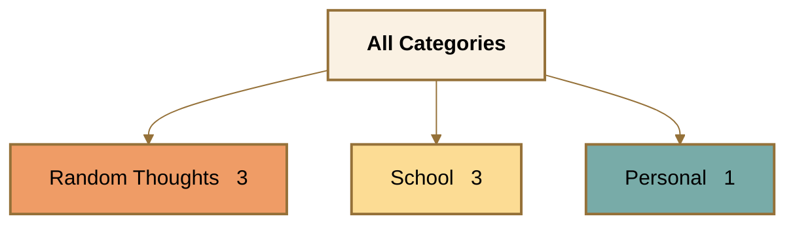
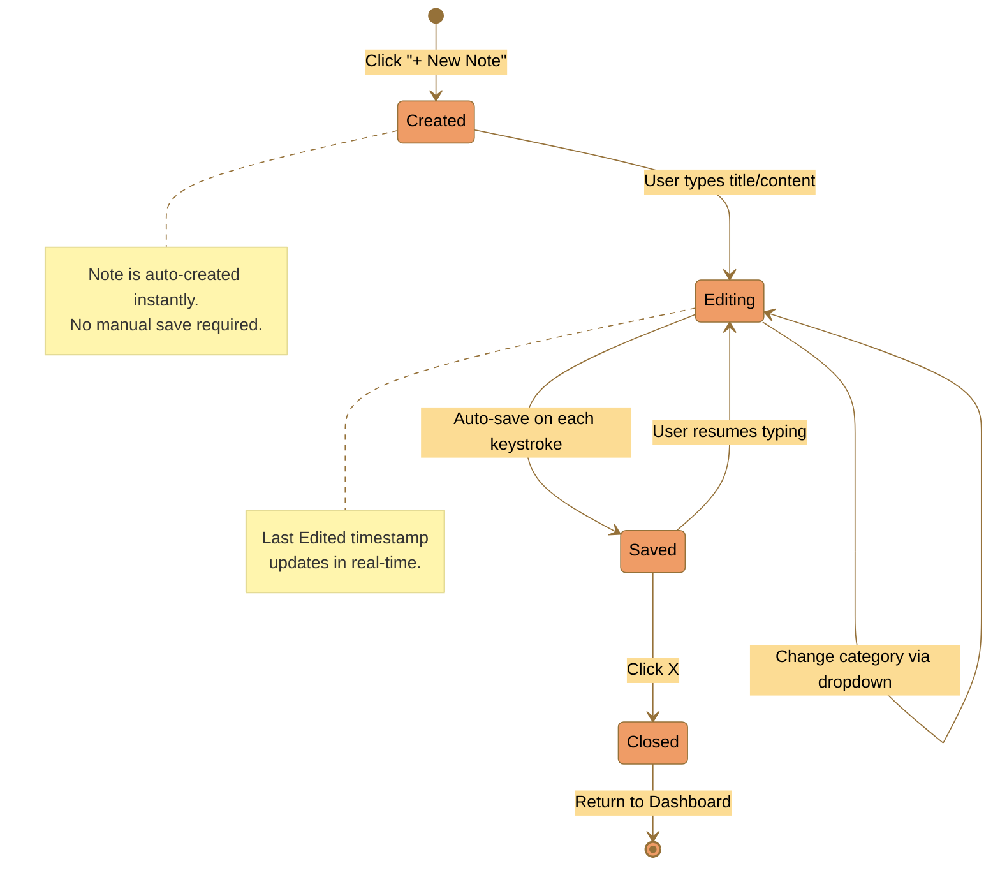
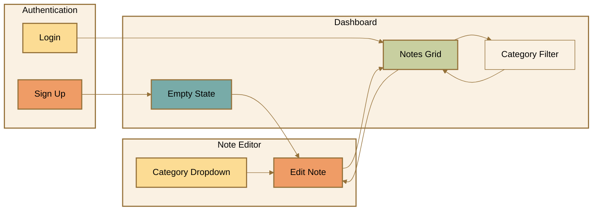
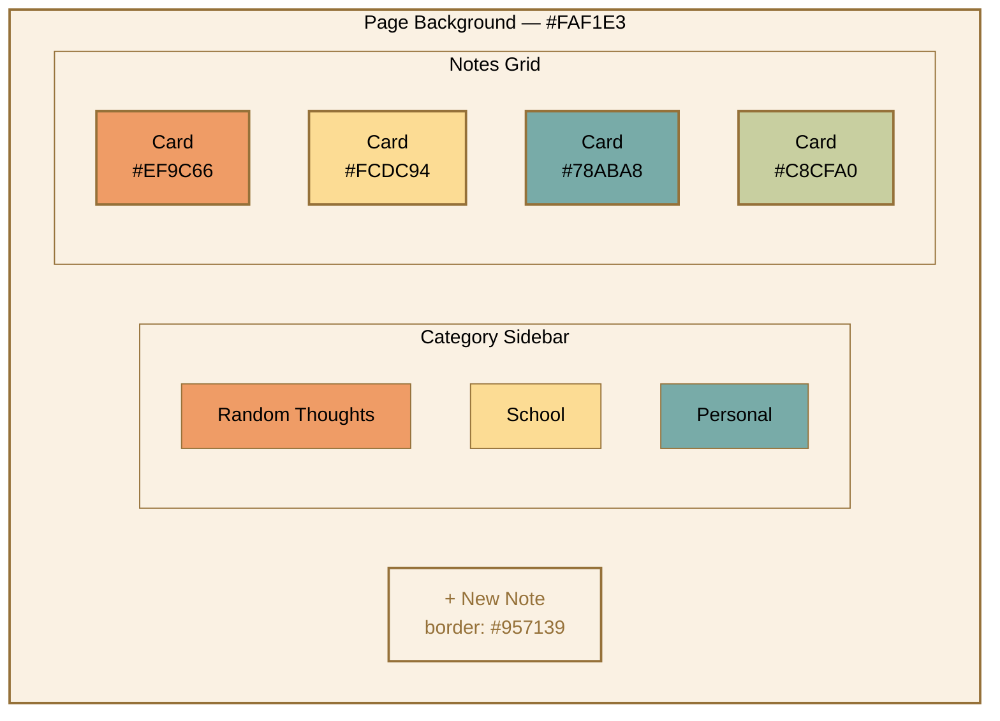
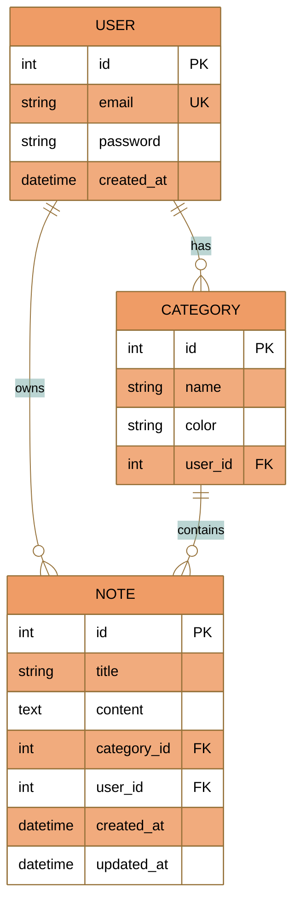
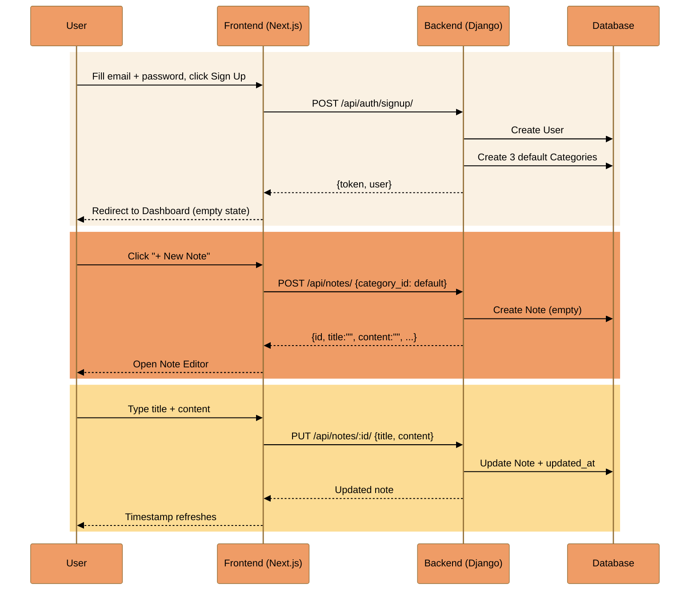
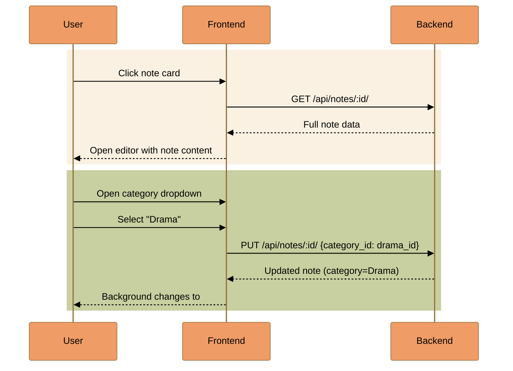

# Notes-Taking App — Requirements Document

> **Tech Stack**: Django / DRF (backend) + Next.js / React (frontend)
> **Time Constraint**: 72 hours

---

## Table of Contents

1. [Overview](#1-overview)
2. [Architecture & Tech Stack](#2-architecture--tech-stack)
3. [Functional Requirements](#3-functional-requirements)
   - [3.1 Authentication](#31-authentication)
   - [3.2 Categories](#32-categories)
   - [3.3 Notes CRUD](#33-notes-crud)
   - [3.4 Note Preview Cards](#34-note-preview-cards)
   - [3.5 Empty State](#35-empty-state)
   - [3.6 Non-Functional Requirements](#36-non-functional-requirements) (Docker, Swagger, Testing)
4. [UI/UX Specifications](#4-uiux-specifications)
5. [Design Tokens & Color Palette](#5-design-tokens--color-palette)
6. [Screen Inventory](#6-screen-inventory)
7. [Data Model](#7-data-model)
8. [API Endpoints](#8-api-endpoints)
9. [Key Interaction Flows](#9-key-interaction-flows)
10. [Deliverables Checklist](#10-deliverables-checklist)

---

## 1. Overview

A simple, aesthetic notes-taking application where users can sign up, create, edit, and organize notes by colored categories. The app targets users who want to keep track of their thoughts in an organized and visually pleasant way.



---

## 2. Architecture & Tech Stack

| Layer | Technology | Role |
|-------|-----------|------|
| **Frontend** | Next.js + React | SPA with SSR capabilities, UI rendering |
| **Backend** | Django + Django REST Framework | REST API, business logic, auth |
| **Database** | PostgreSQL (recommended) | Data persistence |
| **Containerization** | Docker + Docker Compose | Reproducible dev/prod environment — app **must** run from container |
| **API Docs** | Swagger / OpenAPI (drf-spectacular) | Auto-generated, served at `/api/docs/` |
| **Testing** | pytest + Django TestCase | Unit tests + integration tests — **required** |



---

## 3. Functional Requirements

### 3.1 Authentication

#### Sign Up Screen
- **Heading**: "Yay, New Friend!" with a cute sleeping cat illustration
- **Fields**: Email address, Password (with visibility toggle icon)
- **Action**: "Sign Up" button (pill-shaped, golden brown outline)
- **Navigation**: Link "We're already friends!" redirects to Login
- **On success**: Create 3 default categories, redirect to empty dashboard

#### Login Screen
- **Heading**: "Yay, You're Back!" with a cactus illustration
- **Fields**: Email address, Password (with visibility toggle icon)
- **Action**: "Login" button (pill-shaped, golden brown outline)
- **Navigation**: Link "Oops! I've never been here before" redirects to Sign Up
- **On success**: Redirect to dashboard with user's notes



---

### 3.2 Categories

| Property | Description |
|----------|-------------|
| **Default set** | Random Thoughts, School, Personal — auto-created on signup |
| **Sidebar display** | "All Categories" header at top, then each category row with: color dot, name, note count |
| **Filtering** | Clicking a category shows only its notes; "All Categories" shows all |
| **Note editor** | Dropdown selector showing color dot + name for each category |
| **Color mapping** | Each category has a unique color applied to its dot, card background, and editor background |

**Category Color Assignments:**

| Category | Dot Color | Card/Editor Background |
|----------|-----------|----------------------|
| Random Thoughts | `#EF9C66` (peach) | `#EF9C66` |
| School | `#FCDC94` (soft yellow) | `#FCDC94` |
| Personal | `#78ABA8` (sage teal) | `#78ABA8` |
| Drama | `#C8CFA0` (olive green) | `#C8CFA0` |



---

### 3.3 Notes CRUD

#### Create
- User clicks **"+ New Note"** button (top-right, pill-shaped)
- Note is **automatically created** — no save button needed
- Opens note editor with default category (Random Thoughts)
- Placeholder title: "Note Title"
- Placeholder content: "Pour your heart out..."

#### Read
- Notes displayed as **preview cards** in a responsive grid (see [3.4](#34-note-preview-cards))
- Click a card to open the full note editor

#### Update
- **Title**: Editable inline (bold, serif font)
- **Content**: Editable inline
- **Category**: Changeable via dropdown — background color updates immediately
- **Last Edited**: Timestamp updates live as the user types
  - Format: `Last Edited: July 21, 2024 at 8:39pm`
- Close editor by clicking the **X** icon (top-right)

#### Delete
- Not explicitly demonstrated in the Figma/video — consider as stretch goal



---

### 3.4 Note Preview Cards

Each note appears as a card in the dashboard grid with the following layout:

```
+----------------------------------------+
| **month day**   Category Name          |
|                                        |
| **Note Title**                         |
|                                        |
| Note content preview text that may be  |
| truncated if too long...               |
+----------------------------------------+
```

**Card properties:**
- **Background color**: Matches the note's category color
- **Border**: Slightly darker shade of the category color, rounded corners
- **Date** (bold): Displayed with relative formatting rules:

| Condition | Display |
|-----------|---------|
| Note edited today | `today` |
| Note edited yesterday | `yesterday` |
| Older than yesterday | `Month Day` (e.g., `July 16`) — **no year** |

- **Category name**: Regular weight, next to the date
- **Title**: Large, bold, serif font
- **Content**: Regular weight, truncated with `...` if overflowing

---

### 3.5 Empty State

When a new user has no notes:
- **Illustration**: Cute bubble tea character (centered)
- **Message**: *"I'm just here waiting for your charming notes..."*
- Sidebar still shows the 3 default categories (without note counts)
- "+ New Note" button is visible

---

### 3.6 Non-Functional Requirements

#### Docker Container

The application **must** run entirely from a Docker container setup. A single `docker compose up` command should bring up the full stack (frontend, backend, database). No local installation of Python, Node.js, or PostgreSQL should be needed by the evaluator.

- `Dockerfile` for Django backend
- `Dockerfile` for Next.js frontend
- `docker-compose.yml` orchestrating all services
- Volume mounts for database persistence
- Environment variables via `.env` file

#### Swagger / OpenAPI Documentation

The API **must** be documented using Swagger / OpenAPI, auto-generated from DRF serializers and views.

- Accessible at `/api/docs/` when the server is running
- Use `drf-spectacular` (recommended) or `drf-yasg`
- All endpoints documented with request/response schemas
- Authentication requirements clearly indicated per endpoint

#### Testing

The application **must** include both unit and integration tests.

**Unit Tests:**
- Model validation and constraints
- Serializer input/output correctness
- Utility functions (e.g., date formatting logic)
- Category auto-creation on signup

**Integration Tests:**
- Full signup → login → create note → edit note → filter by category flow
- API endpoint response codes and payloads
- Authentication enforcement (unauthorized access returns 401)
- Category filtering returns correct notes
- Note `updated_at` timestamp changes on edit

#### Postman Collection / Request Examples

Sample API calls **must** be provided so evaluators can quickly test endpoints without reading code.

- Export as `.json` Postman collection or include `curl` examples in the README
- Cover all endpoints: signup, login, list categories, CRUD notes, filter by category

#### Environment Configuration

- `.env.example` file **must** be included with all required variables and sensible defaults
- Document each variable's purpose

#### Setup Instructions

- README **must** include step-by-step instructions for both Docker and local development
- Docker path: `docker compose up` and done
- Local path: Python/Node prerequisites, install dependencies, run migrations, start servers

---

## 4. UI/UX Specifications



### Global Styles

| Element | Specification |
|---------|--------------|
| **Background** | Warm cream `#FAF1E3` |
| **Corners** | Rounded throughout — cards (`~20px`), buttons (`pill / ~46px`), inputs (`~8px`) |
| **Accent color** | Golden brown `#957139` — used for borders, button outlines, icons (X, chevron), links |
| **Title font** | Serif (e.g., Georgia / Playfair Display) — bold |
| **Body font** | Sans-serif (e.g., Inter / system font) — regular weight |
| **Text color** | Black `#000000` on colored backgrounds |

### Component Details

| Component | Details |
|-----------|---------|
| **"+ New Note" button** | Top-right corner, pill-shaped, golden brown `#957139` border, transparent/cream background, hover fills slightly |
| **Category sidebar** | Left-aligned, fixed width (~220px), no background color (inherits cream), items have color dot (11px circle) + name + count |
| **Category sidebar — selected** | Row highlighted with a beige/tan tint |
| **Note card** | Rounded rectangle, category-colored background, ~1px border in a slightly darker shade |
| **Note editor** | Full-width modal/overlay, category-colored background, rounded corners, "Last Edited" timestamp top-right |
| **Category dropdown** | Golden brown border, shows current category dot + name + chevron, opens list with all categories (dot + name each) |
| **Close icon (X)** | Golden brown, top-right of editor |
| **Password toggle** | Small icon inside the password field, right-aligned |

---

## 5. Design Tokens & Color Palette

| Token Name | Hex | Swatch | Usage |
|-----------|-----|--------|-------|
| Cream Background | `#FAF1E3` |  | Page background, sidebar bg |
| Random Thoughts | `#EF9C66` |  | Category dot, card bg, editor bg |
| School | `#FCDC94` |  | Category dot, card bg, editor bg |
| Personal | `#78ABA8` |  | Category dot, card bg, editor bg |
| Drama | `#C8CFA0` |  | Category dot, card bg, editor bg |
| Golden Accent | `#957139` |  | Borders, buttons, icons, links |
| Dark Text | `#000000` |  | Body text, headings |



---

## 6. Screen Inventory

All screens from the Figma design:

| # | Figma Frame | Screen | Description |
|---|------------|--------|-------------|
| 1 | MacBook Air - 14 | **Sign Up** | Cat illustration, "Yay, New Friend!", email + password fields, Sign Up button |
| 2 | MacBook Air - 13 | **Login** | Cactus illustration, "Yay, You're Back!", email + password fields, Login button |
| 3 | MacBook Air - 12 | **Empty State** | Bubble tea illustration, "I'm just here waiting for your charming notes..." |
| 4 | MacBook Air - 1 | **Dashboard — All** | All 7 notes visible, all categories in sidebar with counts |
| 5 | MacBook Air - 7 | **Dashboard — Random Thoughts** | Filtered: 3 Random Thoughts notes only |
| 6 | MacBook Air - 8 | **Dashboard — School** | Filtered: 3 School notes only |
| 7 | MacBook Air - 9 | **Dashboard — Personal** | Filtered: 1 Personal note only |
| 8 | MacBook Air - 2 | **Note Editor — Random Thoughts** | Peach background, empty note, "Pour your heart out..." |
| 9 | MacBook Air - 3 | **Note Editor — Dropdown Open** | Category dropdown showing Personal, School, Drama options |
| 10 | MacBook Air - 4 | **Note Editor — Personal** | Teal background, empty note |
| 11 | MacBook Air - 5 | **Note Editor — School** | Yellow background, empty note |
| 12 | MacBook Air - 6 | **Note Editor — Drama** | Olive green background, empty note |
| 13 | MacBook Air - 10 | **Note Editor — With Content** | Random Thoughts note with long-form content filled in |

**Component Exports:**
| File | Description |
|------|-------------|
| `Button.png` | "+ New Note" button — default and hover states |
| `Category.png` | Category sidebar item — default and selected states |
| `Category Dropdown.png` | Category selector — closed and open states |
| `Notes.png` | Note preview card template |
| `Iconography - Caesarzkn.png` | Close (X) icon |

---

## 7. Data Model



### Model Details

**User**
| Field | Type | Constraints |
|-------|------|------------|
| `id` | Integer | Primary Key, auto-increment |
| `email` | String | Unique, required |
| `password` | String | Hashed, required |
| `created_at` | DateTime | Auto-set on creation |

**Category**
| Field | Type | Constraints |
|-------|------|------------|
| `id` | Integer | Primary Key, auto-increment |
| `name` | String | Required (e.g., "Random Thoughts") |
| `color` | String | Hex code (e.g., "#EF9C66") |
| `user_id` | FK → User | Required |

**Note**
| Field | Type | Constraints |
|-------|------|------------|
| `id` | Integer | Primary Key, auto-increment |
| `title` | String | Default: "" |
| `content` | Text | Default: "" |
| `category_id` | FK → Category | Required |
| `user_id` | FK → User | Required |
| `created_at` | DateTime | Auto-set on creation |
| `updated_at` | DateTime | Auto-updated on every save |

---

## 8. API Endpoints

### Authentication

| Method | Endpoint | Description | Request Body | Response |
|--------|----------|-------------|-------------|----------|
| `POST` | `/api/auth/signup/` | Register new user | `{email, password}` | `{token, user}` |
| `POST` | `/api/auth/login/` | Authenticate user | `{email, password}` | `{token, user}` |

### Categories

| Method | Endpoint | Description | Auth | Response |
|--------|----------|-------------|------|----------|
| `GET` | `/api/categories/` | List user's categories | Required | `[{id, name, color, note_count}]` |

### Notes

| Method | Endpoint | Description | Auth | Request/Response |
|--------|----------|-------------|------|-----------------|
| `GET` | `/api/notes/` | List user's notes | Required | `[{id, title, content, category, updated_at}]` |
| `GET` | `/api/notes/?category=:id` | Filter notes by category | Required | Same as above, filtered |
| `POST` | `/api/notes/` | Create a new note | Required | `{category_id}` → `{id, title, content, category, updated_at}` |
| `GET` | `/api/notes/:id/` | Get single note | Required | `{id, title, content, category, created_at, updated_at}` |
| `PUT` | `/api/notes/:id/` | Update a note | Required | `{title?, content?, category_id?}` → updated note |
| `DELETE` | `/api/notes/:id/` | Delete a note | Required | `204 No Content` |

---

## 9. Key Interaction Flows

### Sign Up + First Note



### Edit Note & Change Category



---

## 10. Deliverables Checklist

- [x] **Source Code** — Complete codebase in a public GitHub repo
- [x] **README** — Summary of process, key design/technical decisions, AI tools used
- [x] **Docker Container** — App runs entirely from Docker Compose (`docker compose up` is all the evaluator needs)
- [x] **Swagger / OpenAPI Documentation** — Auto-generated API docs from DRF, accessible at `/api/docs/`
- [x] **Unit Tests** — Django's built-in test framework covering models, serializers, and utilities
- [x] **Integration Tests** — End-to-end API flow tests covering auth, CRUD operations, and category filtering
- [x] **Postman Collection / Request Examples** — curl examples in README
- [x] **Environment Configuration** — `.env.example` with required variables
- [x] **Setup Instructions** — Step-by-step in README for local and Docker runs

